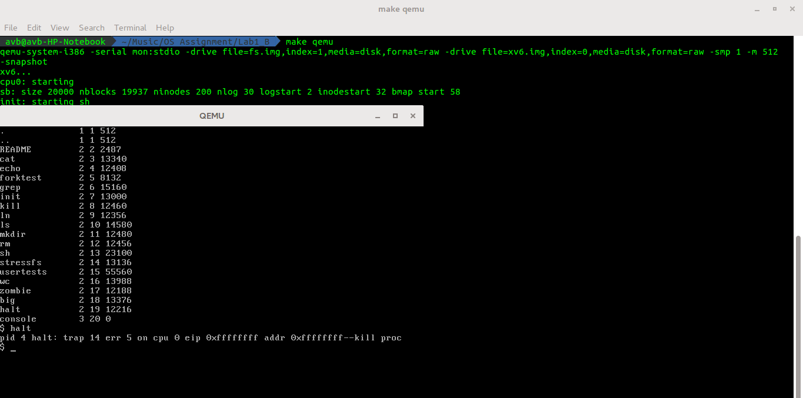
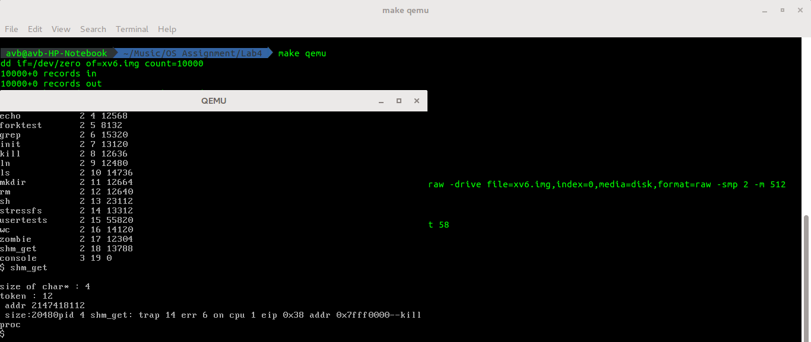
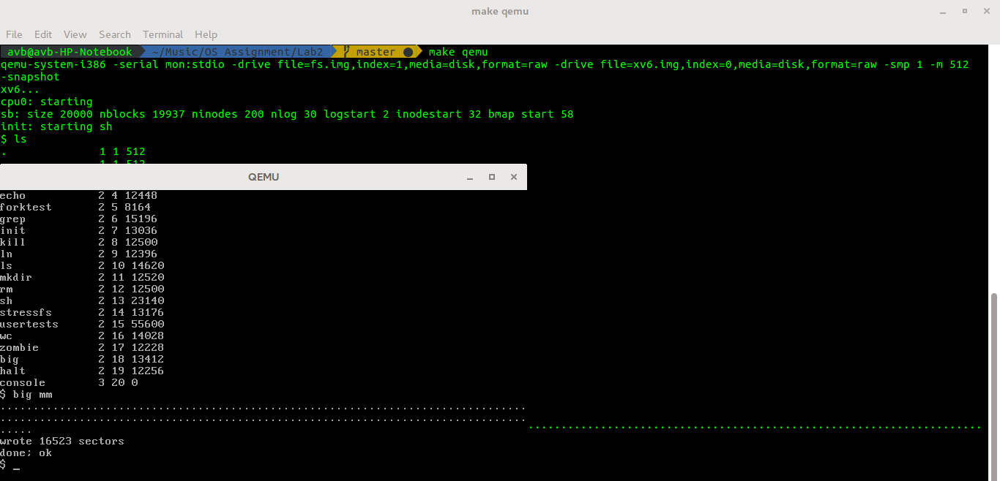

# XV6 - OS
	* Lab1_A which contains the xv6 version with process tracing
	* Lab1_B which contains the xv6 version with halt system call implemented
	* Lab2 which contains the xv6 version with Big data file implemented
	* Lab4 which contains the xv6 version with shmget system call 

## to run the Lab1_A version-:
	* run `make`
	* run `make qemu`
	it will list the system call name and its return value
	NOTE:
		The files i changed:
		* syscall.c

## to run the Lab1_B version-:
	* run `make`
	* run `make qemu`
	* run `halt` to run the halt system call
	NOTE:
		The files i changed:
		* Makefile
		* Created halt.c
		* sysproc.c
		* syscall.h
		* syscall.c
		* user.h
		* usys.S
		* defs.h

## to run the Lab4 version-:
	* run `make`
	* run `make qemu`
	* run `shm_get` to run the shm_get system call
	NOTE:
		The files i changed:
		* Makefile
		* defs.h
		* proc.c
		* proc.h
		* syscall.c
		* syscall.h
		* sysproc.h
		* sysproc.c
		* created shm_get.c
		* user.h
		* usys.S
		* vm.c

## to run the Lab2 version-:
	* run `make`
	* run `make qemu`
	* run `big *`
	NOTE:
		The files i changed:
		* Makefile
		* mkfs.c
		* fs.c
		* fs.h
		* param.h
		* created big.c

